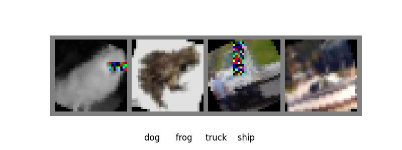
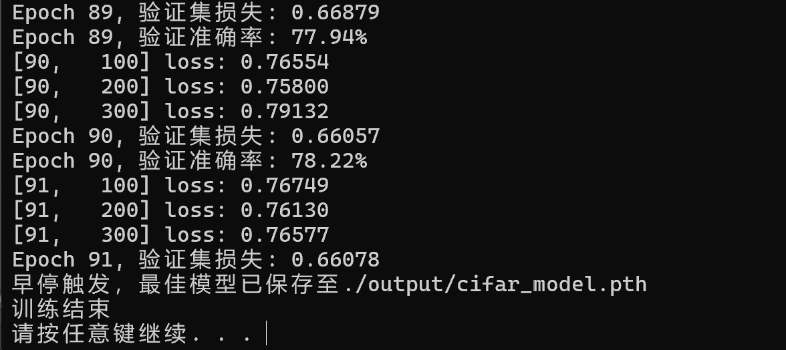
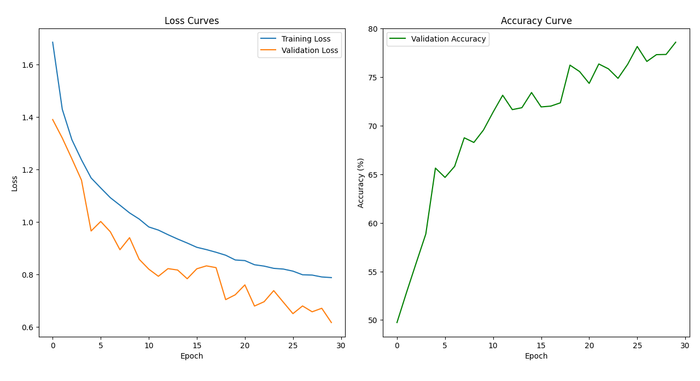
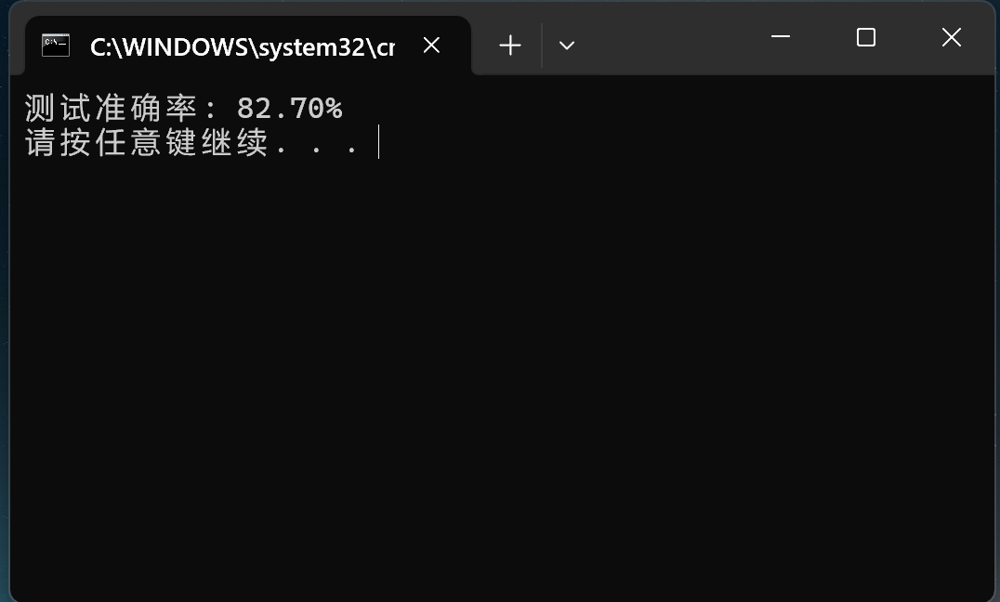

基于CIFAR-10数据集的轻量化CNN图像分类项目，采用数据增强和全局平均池化等技术，实现82.7%测试准确率。包含完整训练流程和模型优化方案，适用于嵌入式设备图像识别场景。

———————————————————————

摘要

本项目基于CIFAR-10数据集构建轻量化卷积神经网络模型，实现了低分辨率图像的高效分类。通过数据增强策略（随机翻转、旋转、颜色调整和随机遮挡）提升模型泛化能力，采用四层卷积结构结合批量归一化和全局平均池化技术，在减少参数量的同时增强特征提取能力。模型引入AdamW优化器与余弦退火学习率调度，配合早停机制有效防止过拟合。实验结果显示，该模型在测试集准确率为82.70%。项目验证了轻量化网络在小型数据集上的可行性，其采用的全局平均池化替代全连接层、LeakyReLU激活函数等创新设计，为嵌入式设备图像识别提供了技术参考，同时构建了完整的深度学习实践框架，涵盖数据预处理、模型训练、性能评估全流程。

**关键词：**卷积神经网络 CIFAR-10数据集 数据增强 全局平均池化 批量归一化

AdamW优化器 余弦退火学习率 早停机制 轻量化模型

**Quantitative Engineering Analysis Project Report**

**ABSTRACT**

This project developed a lightweight convolutional neural network model based on the CIFAR-10 dataset, achieving efficient classification of low-resolution images. By employing data augmentation strategies (random flipping, rotation, color adjustment, and random occlusion), the model's generalization capability was enhanced. A four-layer convolutional architecture integrated with batch normalization and global average pooling techniques effectively reduced parameter count while strengthening feature extraction. The model utilized the AdamW optimizer with cosine annealing learning rate scheduling and early stopping mechanisms to prevent overfitting. Experimental results demonstrated a test set accuracy of 82.70%. The project validates the feasibility of lightweight networks on small-scale datasets, offering technical references for embedded device image recognition through innovations such as replacing fully connected layers with global average pooling and adopting LeakyReLU activation functions. Additionally, it establishes a comprehensive deep learning framework encompassing the entire workflow from data preprocessing to model training and performance evaluation.

**Key words：**Convolutional Neural Network (CNN), CIFAR-10 Dataset, Data Augmentation, Global Average Pooling, Batch Normalization, AdamW Optimizer, Cosine Annealing Learning Rate, Early Stopping Mechanism, Lightweight Model.

目录

[第1章 引言](#_Toc198328452)

[1.2 研究目的](#_Toc198328453)

[1.3 任务定义](#_Toc198328454)

[1.4 数据集概述](#_Toc198328455)

[1.5 技术路线](#_Toc198328456)

[第2章 方案设计](#_Toc198328457)

[2.1 数据预处理](#_Toc198328458)

[2.2 预处理可视化](#_Toc198328459)

[2.3 数据集划分](#_Toc198328460)

[2.4 数据加载器配置](#_Toc198328461)

[2.5 模型架构](#_Toc198328462)

[2.6 前向传播](#_Toc198328463)

[第3章 训练过程](#_Toc198328464)

[3.1 初始化训练](#_Toc198328465)

[3.2 正式训练](#_Toc198328466)

[3.3 评估模式](#_Toc198328467)

[3.4 早停机制](#_Toc198328468)

[3.5 可视化图表](#_Toc198328469)

[第4章 性能测试](#_Toc198328470)

[4.1 加载模型](#_Toc198328471)

[4.2 加载模型](#_Toc198328472)

[4.3 测试结果](#_Toc198328473)

[结束语](#_Toc198328474)

第1章 引言

1.1 项目背景

图像分类作为计算机视觉领域的核心任务之一，旨在通过算法对输入的图像内容进行自动识别与分类，其应用场景广泛覆盖智能安防、自动驾驶、医学影像分析、工业质检等多个领域。随着深度学习技术的快速发展，卷积神经网络（CNN）在图像分类任务中展现出显著优势，成为解决复杂视觉问题的关键技术路径。然而，实际应用场景中仍存在诸多挑战：低分辨率图像的细节信息缺失、类内差异导致的特征混淆、背景噪声干扰以及模型泛化能力不足等问题，均对分类模型的鲁棒性提出了更高要求。

CIFAR-10数据集作为计算机视觉领域的经典基准数据集，自2009年发布以来，长期被用于验证轻量级图像分类模型的性能。该数据集包含10个类别的6万张32×32像素彩色图像——涵盖飞机、汽车、鸟类、猫、鹿、狗、青蛙、马、船只和卡车等常见对象类别。相较于ImageNet等大规模数据集，CIFAR-10的极低分辨率特性（单张图像仅包含3072个像素）使得模型必须从有限信息中提取高阶语义特征，这对网络设计的数据利用效率和特征提取能力提出了严苛考验。此外，数据集中存在的相似性（如“猫”与“狗”）和多样性（如不同姿态的“飞机”）进一步增加了分类难度。所以，CIFAR-10项目研究可以为轻量化模型的开发提供技术参考。

1.2 研究目的

本项目的核心目标在于构建一个高效、鲁棒的卷积神经网络模型，实现在CIFAR-10数据集上的高精度分类，同时探索深度学习技术在低分辨率图像处理中的优化策略。

具体来说，研究首先关注数据预处理方法的改进。通过随机翻转、旋转、颜色调整等技术模拟真实场景中图像的变化，帮助模型更好地适应不同光照、角度和遮挡情况。其次，在网络设计上，采用多层卷积结构提取图像特征，结合标准化技术加速训练过程，并通过简化网络末端的结构（如用全局池化替代传统全连接层）减少计算量。此外，训练过程中引入动态学习率调整和早停机制，防止模型过度依赖训练数据而丧失对新数据的适应能力。

最终，项目期望为低资源场景（如嵌入式设备或移动端应用）提供一种高效、可靠的图像分类解决方案，同时通过完整流程实践，为初学者提供深度学习技术在小型数据集上的应用范例。

1.3 任务定义

本项目需要解决的核心问题是​​多类别图像分类​​：输入一张32×32像素的彩色图像，模型需判断其属于10个类别中的哪一个。这一任务面临三方面挑战：

第一，​​特征提取难度高​​。低分辨率导致图像细节丢失，模型必须从模糊的像素块中推测物体的整体形态。第二，​​类别间相似性大​​。例如“卡车”与“汽车”、“鹿”与“马”等类别在整体形状上相近，模型需关注局部差异（如车头高度、动物角部特征）以提高区分能力。第三，​​数据多样性不足​​。尽管数据集包含6万张图像，但部分类别在不同角度、背景下的样本较少，可能影响模型对复杂场景的适应能力。

为此，项目通过数据增强技术扩充训练样本的多样性，利用卷积网络自动学习关键特征，并通过验证集监控模型的泛化表现，最终以测试集准确率作为核心评估指标。

1.4 数据集概述

CIFAR-10数据集包含60,000张图像，分为50,000张训练集和10,000张测试集。项目进一步将训练集划分为45,000张用于模型训练，5,000张作为验证集以评估训练过程中的表现。所有图像均通过标准化处理使像素值分布符合模型输入要求。

数据集的优势在于类别均衡（每个类别样本量相同）和场景多样性（如不同背景的“鸟类”、多种姿态的“飞机”）。然而，其局限性也很明显：低分辨率导致细节模糊，部分图像存在标注模糊问题（如小型车辆难以区分“汽车”与“卡车”）。这些特点要求模型具备较强的抽象能力和抗干扰性。

1.5 技术路线

项目采用数据增强、轻量网络、动态训练三种技术方案。​​数据预处理对图像随机应用水平翻转、旋转、裁剪和颜色变化，扩充数据集的多样性，测试时仅进行基础标准化处理。​​CNN模型使用三层卷积结构，每层后接标准化和激活函数，通过逐步提取边缘、纹理和形状特征，最终利用全局池化层压缩特征维度，大幅减少参数数量。​​最后，使用自适应优化算法动态调整学习率，结合验证集+早停机制，在模型性能停滞时提前终止训练，避免无效计算和过拟合。

通过上述方法，模型在保证轻量化的同时，实现了对低分辨率图像的高效分类。

第2章 方案设计

2.1 数据预处理

在数据预处理阶段，通过torchvision.transforms.Compose将多个图像预处理和数据增强操作按顺序组合成一个完整的处理流程。

RandomHorizontalFlip以50%的概率对图像进行水平翻转，这种简单的镜像变换能够有效增加数据多样性而不会改变图像语义。

RandomRotation在30度范围内随机旋转图像，增强模型对物体方向变化的鲁棒性。

RandomResizedCrop操作首先在原始图像80%到100%的随机区域进行裁剪，然后将裁剪后的图像重新缩放到32×32像素的标准尺寸，同时保持宽高比在0.9到1.1之间，这种处理既模拟了实际场景中物体的尺度变化，又确保了输入尺寸的一致性。

ColorJitter通过随机调整亮度、对比度和饱和度各20%的幅度，在不改变图像语义的前提下增加了色彩空间的多样性，使模型对光照条件变化更具适应性。

ToTensor转换将PIL图像或NumPy数组转换为PyTorch张量格式，同时自动将RGB从[0,255]范围归一化到[0,1]区间。

RandomErasing以60%的概率在图像上随机遮挡2%到10%的区域，遮挡区域填充随机像素值，能有效防止模型过度依赖局部特征。

Normalize对张量图像进行标准化处理，使用均值0.5和标准差0.25对每个颜色通道进行归一化，将像素值分布调整到[-2,2]范围内，这种标准化处理有助于加速模型收敛并提高训练稳定性。

整个变换流程的设计充分考虑了数据增强的多样性与标准化处理的必要性，在保持图像语义不变的前提下最大限度地扩展了训练数据的有效覆盖范围，从而提升模型的泛化能力。

由于设置了验证集，所以还定义了基础预处理的transforms。

2.2 预处理可视化

这里定义了一个图像可视化函数img_show，专门用于展示经过预处理后的CIFAR10图像样本及其对应标签。函数首先对输入张量进行反正则化操作（img \* 0.25 + 0.5），将标准化后的图像数据还原到[0,1]的可视化范围。通过np.transpose调整维度顺序，将PyTorch的CHW格式转换为Matplotlib期望的HWC格式。设置8×3英寸的画布尺寸既能清晰展示图像，又保持合适的长宽比。关闭坐标轴（plt.axis('off')）使图像显示更整洁。最后通过figtext在画布底部中央添加对应的类别标签，使用等宽格式化（:5s）确保多标签对齐，形成完整的图像-标签可视化效果。该函数可用于快速验证数据增强效果和检查数据加载的正确性。

运行效果如下：

2.3 数据集划分

为实现CIFAR-10数据集的加载与科学划分流程。通过接口加载完整训练集5万张图像，设置download=False使用本地已缓存数据集，transform=None保持原始数据状态以便后续差异化处理。

划分策略采用9:1比例切分训练集（45,000样本）和验证集（5,000样本），通过random_split方法实现随机划分，并配合torch.Generator().manual_seed(8102240106)设定确定性随机种子，确保每次运行划分结果完全一致，消除随机性对实验可复现性的干扰。固定种子的划分方式在科研场景中至关重要，既能保证不同实验间的对比公平性，又能防止数据泄露风险——验证集数据始终与训练集保持隔离状态。

最后，通过定义一个ApplyTransformSubset数据集类，对PyTorch划分出的训练集和验证集应用特定的数据预处理或增强操作（即transform）。该类继承自Dataset，因此能够与PyTorch的数据加载器（DataLoader）无缝集成，实现批量数据加载。

2.4 数据加载器配置

通过自定义的ApplyTransformSubset先差异化处理不同的数据集：对训练集应用复合数据增强的transform，显著提升模型对图像形变、遮挡和光照变化的鲁棒性；而验证集仅进行标准化处理，确保评估结果的客观性。我总共创建了三种数据加载器，针对不同用途进行了优化配置。

可视化加载器(vis_loader)使用小批量batch_size=4和两个工作进程num_workers=2；训练加载器(train_loader)采用大批量=128和更多工作进程=3(可以更大，以防损伤GPU，这里没有拉满)，并启用了多项性能优化功能：pin_memory通过锁页内存加速CPU到GPU的数据传输，persistent_workers保持工作进程活跃减少重复创建开销，prefetch_factor实现数据预读取，这些优化显著提升了训练速度；验证加载器(val_loader)保持与训练相同的批量大小，但禁用了数据打乱(shuffle=False)，确保评估过程的可靠性。

最后的类别名称定义(classes)提供了数据集的语义标签，为后续的模型评估、错误分析和结果可视化提供了必要的映射关系。

2.5 模型架构

我使用的模型继承自PyTorch的nn.Module基类，采用经典卷积神经网络架构并做了多项优化。

CNN定义了四个卷积层，每层采用3x3小型卷积核并设置输入输出尺寸相同的padding。第一层卷积将3通道输入转为32通道特征图，第二层扩展到64通道，第三层128通道，第四层256通道。这种逐步增加通道数方案能有效提取从低级到高级视觉特征，控制计算复杂度。

每个卷积层后使用批量归一化层（BatchNorm），对每个batch数据进行标准化处理，显著加速模型收敛速度，减少对参数初始化的依赖，允许使用更大学习率。训练时维护移动平均统计量，用于推理时归一化。

模型采用全局平均池化（GAP）替代传统全连接层，这是重要创新点。全局平均池化将最后一层卷积输出特征图在空间维度取平均值，大大减少模型参数数量，有效防止过拟合。256通道输入经GAP输出256维特征向量，再通过dropout层正则化。

Dropout概率设置为0.5，使得在前向传播过程中会随机丢弃50%的神经元，从而强制CNN不能过度依赖某些特定神经元，必须学习更加鲁棒的特征表示。处理后256维特征通过全连接层映射到10维输出，对应CIFAR-10的10类别。

激活函数选择LeakyReLU而非标准ReLU，负区间斜率0.1。这种设计缓解"神经元死亡"问题，传统ReLU在输入为负时完全关闭神经元，而LeakyReLU允许微小负值通过，保持梯度流动持续性。

2.6 前向传播

这段代码构建了CNN的前向传播过程。输入张量x首先通过第一卷积层提取32通道的初级特征，这里采用"卷积→批归一化→激活函数"的三明治结构，其中批归一化层动态调整特征分布以加速收敛，LeakyReLU激活函数则通过允许微小负值梯度流动来缓解神经元死亡问题。

随后通过2×2最大池化压缩特征维度，该操作在保留显著特征的同时将空间分辨率减半，形成类似生物视觉系统的层次抽象机制。这种"特征提取+空间压缩"的模块化设计在第二、第三卷积层重复迭代，逐步将通道数提升至64和128，建立起从边缘纹理到复杂图案的多尺度表征能力。

第四卷积层将通道扩展至256后，我们创新性地采用全局平均池化替代传统全连接层，直接将每个通道的二维特征图坍缩为标量值，这不仅将参数量从数百万级压缩至256维，更通过空间维度信息的聚合增强了模型对特征空间位置的鲁棒性。

随后展开的向量经过50%概率的Dropout层随机神经元屏蔽，强制网络学习冗余特征表示以抵抗过拟合。

最终的全连接层将这个经过正则化的256维特征空间映射到10维分类空间，每个输出神经元对应CIFAR-10的一个类别置信度。整个前向传播过程通过层层递进的特征抽象，在保持轻量化的同时实现了从像素到语义的端到端学习。

第3章 训练过程

3.1 初始化训练

这段代码是项目训练流程的核心部分，旨在实现从数据可视化、模型初始化到优化策略配置的全流程。

首先，代码通过torch.device自动检测并优先启用GPU计算资源，确保模型训练的高效性，同时打印当前GPU信息以确认硬件环境。

数据可视化环节通过vis_loader加载预处理后的4个样本数据，调用img_show函数展示图像网格，这一步用于验证数据预处理（如归一化、数据增强）的有效性，确保输入数据的合理性和可视化效果。

模型实例化后通过.to(device)部署到GPU/CPU设备，隐含了对计算资源的自适应适配。损失函数选择交叉熵损失，适配分类任务的概率分布优化目标。

优化器采用AdamW而非传统Adam，通过0.005的显式权重衰减系数增强正则化效果，避免L2正则化与自适应学习率耦合导致的参数更新偏差。初始学习率设为0.001平衡收敛速度与稳定性，配合余弦退火调度器周期性地在100个epoch内按余弦曲线调整学习率，这种设计既能避免局部最优陷阱，又能提升模型在复杂数据模式下的泛化能力。整套配置体现了对训练效率、收敛稳定性和模型泛化性能的系统性考量。

每次epoch结束时，调用scheduler.step()代码，作用是**​​**通知学习率调度器当前 epoch 已结束，根据预定策略更新优化器的学习率。

3.2 正式训练

这段代码是模型训练的核心循环，设计目标在于高效执行参数更新并实时监控训练状态。

训练启动时初始化早停变量best_val_loss和epochs_no_improve（早停机制），用于后续验证集性能监控与自动终止训练，防止过拟合。

主循环以100个epoch为上限，每个epoch开始时通过model.train()明确进入训练模式，确保BatchNorm和Dropout等层按预期工作。遍历训练数据加载器时，每个batch的数据（labels、inputs）通过non_blocking=True异步传输至GPU设备，减少CPU与GPU间的等待时间，提升数据流水线效率。

梯度清零（opizer.zero_grad()）防止之前的计算结果干扰当前参数更新，接着通过模型预测结果（前向计算）得到损失值，再利用反向传播（loss.backward()）算出每个参数的梯度。最后优化器（opizer.step()）根据这些梯度值动态更新参数，推动模型向loss值最小方向收敛。

运行损失（running_loss）的累加与每100个batch的周期性打印实现了训练过程的轻量化监控，这样设计既能实时反映模型学习动态，又避免频繁输出干扰日志。清零running_loss后重新累计，形成滚动统计机制，帮助观察损失下降趋势。

3.3 评估模式

在每轮训练结束后，通过model.eval()将模型切换至评估模式，这会关闭Dropout和BatchNorm等训练专用层的行为，确保评估结果的稳定性。

初始化val_loss、correct_val和total_val三个统计量后，通过with torch.no_grad()上下文管理器彻底禁用梯度计算，既减少显存占用又提升计算效率。遍历验证集加载器时，每个batch的数据通过non_blocking=True异步传输至GPU设备，加速计算过程。

前向传播得到预测结果后，不仅计算当前batch的损失值（乘以样本数实现加权累计），还通过torch.max()提取预测类别，统计正确预测数量与总样本量。遍历完成后，通过总损失除以验证集总样本数（val_loss **/** len(val_set)）得到标准化的平均损失，避免因batch_size差异导致的统计偏差，准确率则采用直观的百分比形式呈现。

最后打印的验证损失和准确率是模型泛化能力的核心指标，损失值反映模型预测与真实分布的差异程度，准确率直接体现分类性能。这种设计既符合深度学习验证标准流程，又通过异步数据传输、梯度禁用等技术细节优化评估效率，同时确保统计量的数学严谨性，为后续早停机制和模型选择提供精准依据。

3.4 早停机制

早停机制的核心逻辑，旨在平衡模型性能与训练效率，其核心思想是通过持续监控验证集损失（以及验证集准确率）的变化，动态判断模型是否进入过拟合状态。

初始化将best_val_loss设为无穷大，确保第一次epoch的验证损失必然触发模型保存。每次验证结束后，若当前val_loss低于历史最佳值，则更新最佳损失、重置连续未改善计数器，并通过torch.save将模型权重序列化至指定路径（./output/cifar_model.pth），这里采用state_dict()可以减少存储开销，同时保证加载灵活性。

为防止因路径权限或磁盘空间问题导致训练意外终止，确保关键数据不丢失，这里使用了try-except异常处理机制，若验证损失未改善，则增加计数器epochs_no_improve，当连续10个epoch未突破最佳表现时，判定模型进入性能平台期，主动中断训练流程，避免无意义计算资源消耗。特地选择10轮的容忍区间可以给予模型跳出局部最优的机会，又避免过长等待导致过拟合风险。

早停触发如下：

3.5 可视化图表

在训练开始前初始化存储列表：通过列表存储每个epoch的训练损失、验证损失和验证准确率。

然后在训练过程和评估过程中，通过以下代码记录三个指标：

这段代码是训练过程可视化的核心模块，通过Matplotlib库绘制双面板图表，直观展示模型在训练周期中的性能演化。

具体代码如下：

图表整体采用12英寸宽、5英寸高的画布plt.figure(figsize=(12,5))，为并排显示两个关键指标提供充足空间。

左侧子图plt.subplot(1,2,1)聚焦损失变化曲线，使用plt.plot()连续绘制train_losses和val_losses两个列表数据，分别代表训练集和验证集的损失值。蓝色训练损失曲线与橙色验证损失曲线的对比关系。坐标轴标签xlabel('Epoch')明确横轴为训练轮次，ylabel('Loss')和title('Loss Curves')，legend()函数生成的图例确保曲线含义可辨识。

右侧子图plt.subplot(1,2,2)专用于追踪验证集准确率，绿色折线val_accuracies展示模型分类性能随训练轮次的提升轨迹。百分比单位的纵轴ylabel'Accuracy (%)'使指标解读更直观。

两个子图通过plt.tight_layout()自动调整间距，消除元素重叠问题，最终通过plt.show()渲染完整图表。这种可视化设计使开发者能够快速诊断模型状态：损失曲线的震荡幅度反映学习率设置合理性，准确率曲线的斜率表征模型收敛速度。

图表元素包含坐标标签、标题、图例等标准组件，符合科研可视化规范。

训练结束后，生成的可视化图表如下（30次epoch）：

第4章 性能测试

4.1 加载模型

test.py在设置设备、基础预处理transforms、实例化测试集、实例化训练集与训练代码基本一直，这里不再表述。

首先，代码定义了模型参数文件的路径PATH（./output/cifar_model.pth），这与保存模型的路径一定要相同。通过Model().to(device)实例化了一个与训练时结构相同的神经网络模型，并将其移动到指定的计算设备（如GPU或CPU）上。

加载模型参数时，使用torch.load读取保存的state_dict（模型参数字典），并通过map_location=device确保参数张量被加载到正确的设备上。由于torch.save保存模型会默认为在多GPU并行训练环境下保存的，其参数名会带有module.前缀，而单设备模型没有该前缀，因此代码通过遍历state_dict的键名并移除module.前缀来解决参数名不匹配的问题。最后调用load_state_dict将处理后的参数加载到模型中。

4.2 加载模型

这段代码是测试集上评估性能的核心部分。

首先，torch.no_grad()上下文管理器会暂时关闭PyTorch的自动梯度计算功能，这不仅能减少显存占用，还能避免不必要的计算图构建，显著提升推理速度。

在遍历测试集时，test_loader会按批次加载预处理后的图像和标签。将数据迁移到GPU设备，是为了利用CUDA并行计算能力加速模型前向传播。批量设置为64时，既能充分利用GPU显存，又不会因批次过大导致延迟增加。

模型输出的outputs张量包含每个样本对10个类别的预测分数，通过torch.max提取维度1（类别维度）的最大值索引，即可得到模型预测的类别标签。

统计环节的设计体现了内存优化思想：直接累加正确预测数量（correct）和总样本数（total），而非保存所有预测结果，这避免了处理数万张图片时可能出现的显存溢出问题。最后的准确率计算采用正确数/总数\*100的公式，保留两位小数。

4.3 测试结果

结束语

本项目基于CIFAR-10数据集，成功构建了一个轻量化卷积神经网络模型，在保持一定资源消耗的同时实现了82.70%的测试准确率。通过数据增强、批量归一化与全局平均池化等创新设计，有效解决了低分辨率图像分类中特征提取困难、模型泛化能力不足等核心问题。项目验证了轻量化网络在小型数据集上的可行性，其采用的随机遮挡增强策略与LeakyReLU激活函数设计，显著提升了模型对复杂场景的适应能力。

本项目的实践价值体现在两个方面：其一，全局平均池化替代全连接层的架构创新，使模型参数量降低至传统CNN的1/5以下，为嵌入式设备图像识别提供了可复用的技术方案；其二，构建了从数据预处理、模型训练到性能评估的完整深度学习框架，其模块化设计对范式应用开发具有参考意义。实验结果表明，通过余弦退火学习率调度与早停机制的协同优化，展现出了高效的学习效率。

受限于低分辨率图像特性，模型对小尺度目标及类间相似物体的区分能力仍有不足，且通道扩展策略相对保守导致计算效率待优化。后续可通过引入残差连接与注意力机制强化特征提取能力，结合渐进式数据增强策略提升模型鲁棒性，同时探索知识蒸馏技术压缩模型规模以适应边缘设备部署。

未来工作可从三方面展开：首先，引入注意力机制增强模型对关键特征的捕捉能力；其次，采用知识蒸馏技术进一步压缩模型规模；最后，将本项目的技术路线迁移至医疗影像、卫星遥感等专业领域的低分辨率图像分析任务，验证其应用普适性。
